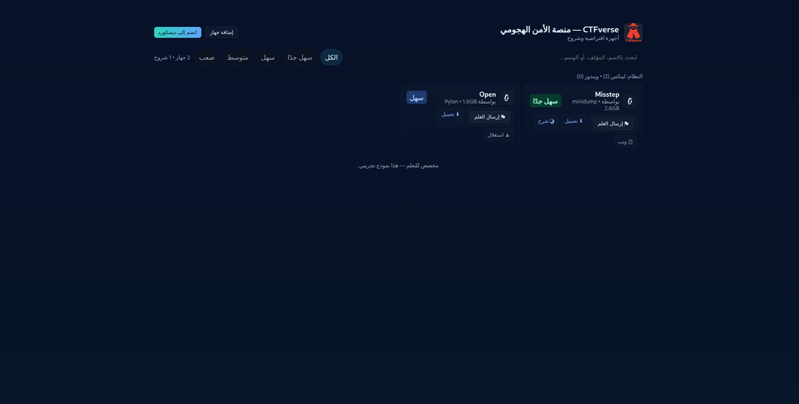

# 🔒 CTFverse — ساحة تدريب CTF

**CTFverse** هو ملعب CTF مبني على أجهزة افتراضية (VMs) قابلة للاختراق،  
تم تطويره باستخدام **HTML, CSS, JavaScript** فقط، بدون أي خادم (Backend).  
المشروع يعرض الأجهزة الافتراضية على شكل بطاقات، مع دعم البحث، الفلاتر، وإضافة أجهزة جديدة عبر نافذة مخصصة.

🌐 **الموقع المباشر:** [ctfverse.com](https://ctfverse.com)

---

## ✨ المميزات

- 🎨 تصميم متجاوب بواجهة حديثة (الوضع الليلي).  
- 🔍 شريط بحث لتصفية الأجهزة حسب الاسم أو المُنشئ.  
- 🏷 فلاتر حسب الصعوبة **(سهل جدًا، سهل، متوسط، صعب)**.  
- 📦 بطاقات تعرض: نظام التشغيل، الحجم، مستوى الصعوبة، والإحصائيات.  
- ➕ نافذة لإضافة جهاز جديد (إرسال عبر البريد).  
- 🏴 نافذة لإرسال العلم (Flag) والتحقق من صحته.  
- ⚡ خفيف وسريع — لا يحتاج أي إعدادات خلفية.  

---

## 🖼️ صور من الموقع

### 🏠 الصفحة الرئيسية


### ➕ نافذة إضافة جهاز


### 🏴 نافذة إرسال العلم


---

## 🛠️ التقنيات المستخدمة

- **HTML5**  
- **CSS3** (تصميم متجاوب)  
- **JavaScript Vanilla** (بدون مكتبات خارجية)  

---

## 🚀 طريقة الاستخدام

1. افتح الموقع [ctfverse.com](https://ctfverse.com).  
2. تصفح الأجهزة الافتراضية عبر البطاقات.  
3. استخدم **شريط البحث** و **الفلاتر** لتضييق النتائج.  
4. لإضافة جهاز جديد:  
   - اضغط زر **إضافة جهاز**.  
   - املأ الحقول (الاسم، المُنشئ، الصعوبة، الفئة، الرابط...).  
   - سيتم تجهيز رسالة بريد تحتوي التفاصيل.  
5. للتحقق من العلم (Flag):  
   - اضغط على زر **إرسال العلم**.  
   - أدخل العلم بالشكل:  
     ```
     ctfverse{your_flag_here}
     ```  
   - ستظهر رسالة ✅ أو ❌ للتأكيد.  

---

## 📌 ملاحظات

- هذا المشروع **نسخة تجريبية (Demo Clone)** للتعلم فقط.  
- جميع البيانات **ثابتة** (Static Data) غير مرتبطة بقاعدة بيانات.  

---

## 📜 الرخصة

MIT License — مجاني ومفتوح المصدر للاستخدام والتطوير.
